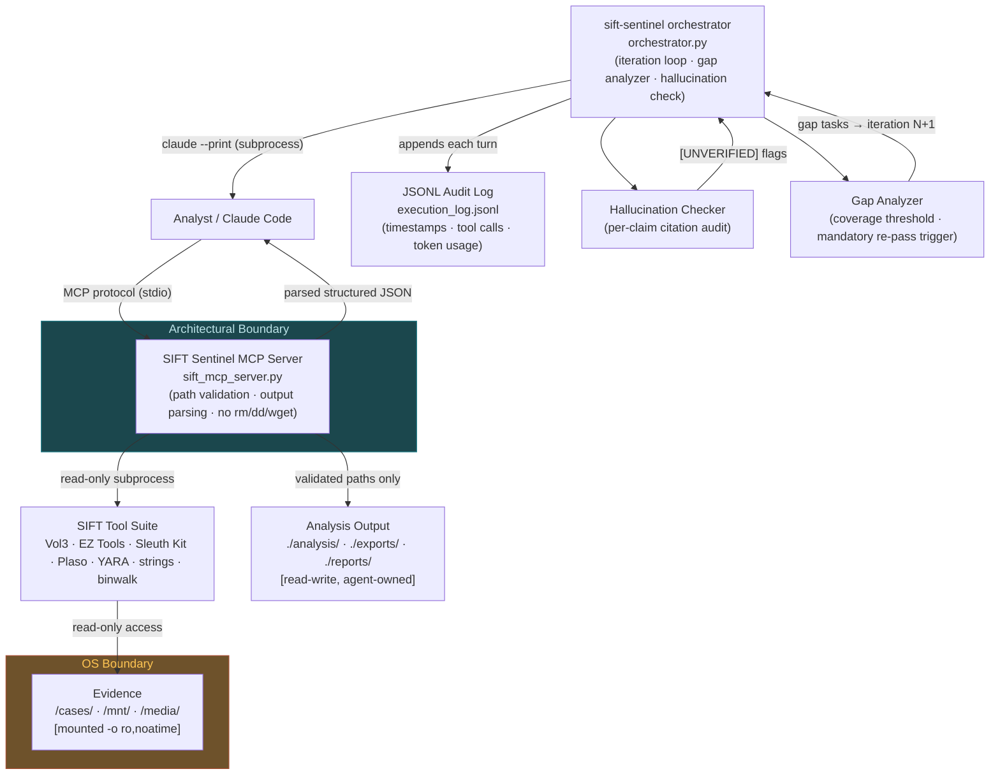

# SIFT Sentinel — Architecture Document

**Version:** 1.0  
**Builder:** Edward Marez ([@marez8505](https://github.com/marez8505))

---

## 1. System Overview

SIFT Sentinel consists of two primary components: a **Custom MCP Server** (`sift_mcp_server.py`) that wraps SIFT's 200+ forensic tools as typed, path-validated functions, and an **Orchestrator** (`orchestrator.py`) that drives an iterative triage loop with hallucination detection and gap analysis. The agent interacts with evidence files exclusively through the MCP server, which enforces evidence integrity at the application layer. The OS enforces it at the kernel layer.

---

## 2. System Diagram



---

## 3. Component Descriptions

### 3.1 SIFT Sentinel MCP Server (`sift_mcp_server.py`)

The MCP server is the sole trust boundary between the LLM and the SIFT tool suite. It exposes approximately 35 curated forensic functions covering memory analysis, filesystem timeline, registry analysis, prefetch/shimcache/amcache examination, network artifact extraction, and YARA scanning.

**Responsibilities:**
- **Path validation** — All evidence paths are resolved to absolute form and checked against an allowlist of evidence directories (`/cases/`, `/mnt/`, `/media/`). Paths containing `..` traversal sequences are rejected.
- **Output parsing** — Raw tool stdout is parsed into structured JSON before being returned to the LLM. The goal is ≤2,000 tokens per tool response regardless of case size.
- **Error normalization** — Recoverable errors (missing Vol3 symbol tables, locked files, unsupported image format) return structured `{error_type, resolution_hint}` objects rather than raw stack traces.
- **No destructive functions** — The server registers no functions for deletion, network transfer, remote access, disk modification, or process execution outside the approved tool list. This constraint is enforced by the absence of registered MCP functions, not by prompt instructions.

**Registered function categories:**
| Category | Functions (count) |
|---|---|
| Memory — process | vol3_pslist, vol3_pstree, vol3_cmdline, vol3_dlllist, vol3_handles, vol3_malfind, vol3_netscan (7) |
| Memory — malware | vol3_yarascan, vol3_hollowfind, vol3_injectedthreads, vol3_ldrmodules (4) |
| Memory — persistence | vol3_svcscan, vol3_registry_printkey, vol3_userassist, vol3_mftscan (4) |
| Disk — filesystem | fls_timeline, tsk_recover, mmls_partitions, istat_inode (4) |
| Disk — artifacts | ez_prefetch, ez_shimcache, ez_amcache, ez_jumplist, ez_recentdocs (5) |
| Disk — registry | ez_regviewer, ez_srum, ez_shellbags, ez_lnkfiles (4) |
| Log analysis | plaso_parse, plaso_psort, grep_evtx, grep_evtx_regex (4) |
| Network | tshark_connections, tshark_dns, tshark_http (3) |

### 3.2 Orchestrator (`orchestrator.py`)

The orchestrator manages the iterative triage loop and enforces the hard iteration ceiling.

**Iteration loop:**
1. Build initial analysis prompt from case metadata and evidence manifest
2. Run `claude --print --mcp-config sift_mcp.json <prompt>` as subprocess
3. Capture and parse LLM response; append turn to `execution_log.jsonl`
4. Run hallucination check: compare every "artifact found" claim against tool call log
5. Run gap analyzer: compare evidence types ingested vs. evidence types analyzed
6. If gap coverage < 60% threshold AND iteration count < max: construct gap-fill prompt and repeat from step 2
7. Otherwise: write `findings.json` and generate HTML report

**Iteration ceiling:**
The `--max-iterations` flag (default: 3) is checked at the top of the loop. When `iteration_count >= max_iterations`, the orchestrator sets `status: MAX_ITERATIONS_REACHED` in the log and writes the report with whatever findings exist. This check is in Python, not in a prompt — the LLM has no mechanism to bypass it.

### 3.3 Hallucination Checker

Runs as a separate `claude --print` call with a structured prompt that:
1. Enumerates every claim of the form "artifact X was found / exists / was observed"
2. Looks up each claim against the `tool_calls` array in the execution log
3. Flags claims with no supporting tool call as `[UNVERIFIED]`
4. Returns a structured JSON list of verified and unverified claims

Unverified claims are retained in the final report but marked `confidence: low, status: unverified`.

### 3.4 Gap Analyzer

After each iteration, the gap analyzer computes:
- **Evidence types present:** `{disk, memory, network, logs}` (derived from evidence manifest)
- **Evidence types analyzed:** parsed from `tool_calls` in execution log
- **Gap score:** `(analyzed_types / applicable_types) × 100`

If gap score < 60 and iterations remain, the analyzer produces a prioritized list of un-analyzed artifact categories that becomes the mandatory scope for the next iteration.

### 3.5 JSONL Audit Log (`execution_log.jsonl`)

Every turn is appended as a single-line JSON object:

```json
{
  "ts": "2026-05-12T14:23:07.441Z",
  "iteration": 1,
  "turn": 3,
  "tool_name": "vol3_malfind",
  "tool_args": {"memory_image": "/cases/memory/rd01-memory.img", "pid": null},
  "tool_result_summary": "14 suspicious regions; 3 flagged JIT/CLR (false positive markers); 11 submitted to hallucination check",
  "tokens_in": 4821,
  "tokens_out": 612,
  "duration_ms": 8340
}
```

Every finding in the final report cites the `ts` and `tool_name` of the tool call that produced it.

---

## 4. Security Boundaries

| Guardrail | Type | Implementation | Bypass Vector |
|---|---|---|---|
| No rm/dd/wget/ssh functions | **Architectural** | Functions not registered in MCP server | None — capability absent |
| Evidence directory read-only | **OS-level** | `mount -o ro,noatime` before agent start | Requires root + remount outside agent process |
| Path traversal blocked | **Architectural** | Allowlist check in MCP server before any subprocess | None if allowlist is correctly maintained |
| Output parsed before LLM | **Architectural** | MCP server transforms stdout before return | None — raw output never reaches LLM |
| Max iterations ceiling | **Architectural** | Python counter in orchestrator.py | None — LLM output does not affect counter |
| Evidence path allowlist | **Architectural** | Hardcoded list in sift_mcp_server.py | Requires modifying server code |
| Hallucination flagging | **Prompt-based** | Structured evaluation prompt | Model could omit flag (mitigated by structured JSON response format) |
| Gap coverage threshold | **Prompt-based + code** | Threshold enforced in Python; gap list generated by LLM | Model could misreport coverage (mitigated by cross-checking tool call log in Python) |

**Classification rationale:** "Architectural" means the constraint is enforced before the LLM response is processed — the agent's reasoning cannot affect it. "Prompt-based" means the behavior is elicited through instructions and could theoretically be subverted by a sufficiently adversarial model response; such cases are mitigated by cross-validation against the tool call log in Python code.

---

## 5. Trust Boundary Analysis

```
[Evidence Files] ── read-only ──► [MCP Server] ── parsed JSON ──► [LLM / Agent]
                                       │
                                  [TRUST BOUNDARY]
                                       │
                        All writes go to ./analysis/ (agent-owned)
                        No writes to /cases/, /mnt/, /media/
```

The MCP server is the single trust boundary. Evidence flows inward (read-only) and analysis output flows outward (write-allowed only to designated output directories). The LLM never has a direct file handle to evidence; it receives only the server's parsed, summarized representation.

**Inbound flow (evidence → LLM):**
1. Orchestrator builds prompt with evidence manifest (paths, sizes, types)
2. LLM calls MCP function with evidence path argument
3. Server validates path is within allowlist
4. Server spawns read-only subprocess (Vol3, EZ Tools, etc.)
5. Server parses output, truncates to token budget, returns JSON
6. LLM receives structured summary — never raw binary or raw tool text

**Outbound flow (LLM → output):**
1. LLM produces findings in structured JSON via MCP `write_findings` function
2. Server validates output path is within `./analysis/` or `./reports/` directories
3. Server writes file; appends write event to audit log
4. Orchestrator generates HTML report from findings JSON

---

## 6. Evidence Integrity Chain

Every finding in the output report is traceable to a specific tool execution:

```
Finding: "STUN.exe at C:\Windows\System32 (PID 1912) — suspicious parent (svchost PID 1244)"
  └─ evidence_chain:
       tool: vol3_pstree
       ts: 2026-05-12T14:19:44.112Z
       args: {memory_image: "/cases/memory/rd01-memory.img"}
       result_excerpt: "PID 1912 STUN.exe parent=1244 (svchost.exe)"
       iteration: 1
       turn: 4
```

The HTML report renders evidence chains as collapsible sections. The `findings.json` structure embeds the full chain for programmatic review.

---

## 7. Data Flow Summary

1. **Analyst** invokes `orchestrator.py` with case directory, evidence paths, and iteration limit
2. **Orchestrator** reads evidence manifest, constructs initial triage prompt
3. **Claude Code** (via `claude --print`) receives prompt, begins MCP tool calls
4. **MCP Server** validates, executes, parses each tool call; returns structured JSON
5. **LLM** synthesizes findings from tool responses; outputs structured analysis
6. **Orchestrator** captures output, appends to audit log, runs hallucination check
7. **Hallucination Checker** flags unverified claims; returns list to orchestrator
8. **Gap Analyzer** identifies uncovered evidence categories; computes gap score
9. If gap score < threshold and iterations remain: **loop to step 2** with gap-fill mandate
10. Otherwise: **Orchestrator** writes `findings.json` and generates HTML report
